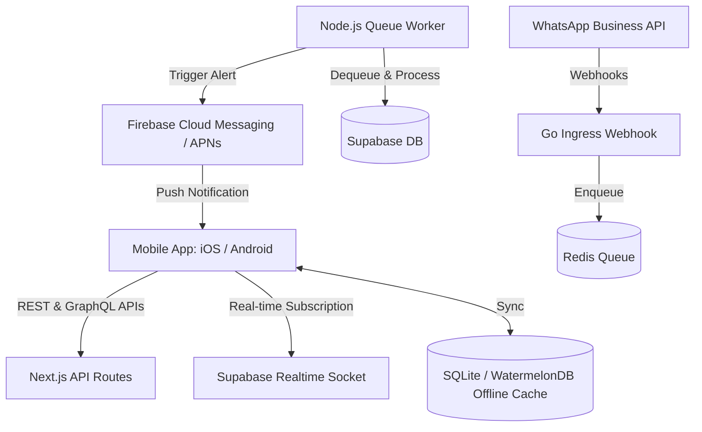
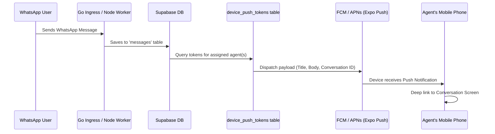

# Companion Mobile App Implementation Plan: iOS & Android

This document outlines the architectural design, technology stack, and phase-by-phase execution plan for building a companion mobile application (iOS & Android) for the **ConvoReal** platform — a WhatsApp-first CRM for Indian real estate agents.

**Status:** Updated after architectural review July 2026. Incorporates critical fixes for API authentication, offline strategy, push infrastructure, and real-time safety.

The mobile app will focus on delivering:
1. **Real-time push notifications** for new WhatsApp messages, system alerts, and assigned leads.
2. **In-app chat console** synced in real-time with the web application and WhatsApp.
3. **Offline access** to contacts, lead notes, and messaging drafts.
4. **Native mobile integrations** (direct phone calling, WhatsApp redirection, contacts sharing, and biometric security).

---

## 🏗️ Architecture Overview

The mobile application will connect directly to the existing Supabase backend (PostgreSQL database, Storage Buckets, and Realtime Channels) and push notification servers.



---

## 🛠️ Technology Stack Recommendations

To maximize code reuse, speed up time-to-market, and leverage the existing TypeScript/React ecosystem of waCRM, we recommend a hybrid cross-platform approach:

| Layer | Recommended Choice | Rationale |
| :--- | :--- | :--- |
| **Framework** | **React Native (Expo SDK)** | Reuses existing React components, business logic, types, and hooks. Expo manages build configurations (Android Gradle/iOS Xcode) out of the box. |
| **State Management** | **Zustand + TanStack Query** | High performance, lightweight client-side state caching with automatic caching, background fetching, and query invalidation. |
| **Real-time Sync** | **Supabase Realtime Client** | Native WebSockets support for subscribing to `INSERT` and `UPDATE` events on the `messages`, `contacts`, and `conversations` tables. |
| **Offline Cache** | **TanStack Query + MMKV/AsyncStorage** | Persistent query cache for offline *reads* (contacts, conversations, notes). Small "pending outbox" table for unsent messages — no hand-rolled sync protocol. |
| **Push Notifications** | **Expo Notifications + FCM/APNs** | Handles credentials, notification certificates, and incoming payloads in foreground/background states. |
| **Authentication** | **Supabase Auth + Native Biometrics** | Secure tokens stored in iOS Keychain/Android Keystore via `expo-secure-store`. Integrates FaceID/TouchID (`expo-local-authentication`). |

---

## 🛠️ Development & Tooling Strategy

### **Zero-Install Development (with Caveats)**
*   **No Android Studio for scaffolding:** We do not need to install Android Studio for initial development; Expo Router handles project structure.
*   **Instant Testing in Expo Go (SDK 52 only):** Development via **Expo Go** works for SDK 52 and earlier. You scan a QR code, and the app runs on your physical Android phone. **Note:** Remote push notifications do NOT work in Expo Go on Android SDK 53+; you will need an EAS development build for Phase 3 onward.
*   **Cloud Builds:** **EAS (Expo Application Services)** builds the final Android App Bundle (`.aab`) in the cloud. No local build infrastructure needed beyond Node.js.
*   **Implications:** Plan for a development build setup midway through Phase 2 to avoid build surprises in Phase 3.

### **Hosting & Infrastructure**
*   **Zero New Hosting:** The mobile app connects directly to your **existing Supabase** database, Storage Buckets, and API routes. No new servers or hosting costs are required.
*   **Over-the-Air (OTA) Updates:** We can push instant updates (bug fixes, text changes) directly to users' phones without requiring them to download a new version from the store.

### **Release Procedure (Android)**
1.  **Google Play Console:** Create an account on the Google Play Console.
    *   *Cost:* One-time **$25 fee** to Google.
2.  **Build:** Run `eas build --platform android` to generate the store-ready file.
3.  **Upload:** Upload the file to the Play Console.
4.  **Review:** Google reviews the app (typically 2–5 days).
5.  **Live:** Once approved, the app is live for download.

### **iOS Portability**
*   **100% Code Reuse:** The code written for Android is the same code used for iOS. We write the logic once, and it works on both platforms.
*   **Future iOS Release:** When you are ready for iOS, you will need:
    *   An **Apple Developer Account** ($99/year).
    *   No Mac is strictly required, as we can also build iOS apps in the cloud using EAS.
*   **Strategy:** We will start with **Android only**, but the code structure will be set up so that when you are ready for iOS, we simply flip a switch and generate the iOS build.

---

## 📱 Core Features & Implementation Details

### 1. Inbuilt Real-time Messaging
The messaging interface is the most critical feature. The app must feel as fast and reliable as a native chat application:

* **Real-time Connection**: Subscribe to Supabase Realtime channel changes:
  ```typescript
  const channel = supabase
    .channel('realtime-messages')
    .on('postgres_changes', { event: 'INSERT', schema: 'public', table: 'messages' }, (payload) => {
      // Append to local message state and show inside UI
      updateLocalChatState(payload.new);
    })
    .subscribe();
  ```
* **Offline Queuing & WhatsApp 24-Hour Window:** When offline, queue messages to the "pending outbox" table with a `pending` status. On connectivity, retry `/api/whatsapp/send`. **Critical:** WhatsApp rejects free-form messages sent outside the 24-hour service window unless they are templates. The app must:
  - Check the customer's last incoming message timestamp before flushing the outbox.
  - If outside the window, show the agent: "⚠️ This message can only be sent as a template — switch to template mode or contact manually."
  - Never silently retry outside the window; the API will reject and the agent sees confusing failures.
* **Media Handling:** WhatsApp media URLs are authenticated and expire after ~24 hours. The app **cannot fetch them directly**. Media must be proxied through `/api/whatsapp/media` (or mirrored to Supabase Storage on ingestion). Verify your queue worker's current media handling and mirror strategy before Phase 2.
* **Rich Media:** Support viewing images and parsing template buttons. Use `expo-audio` (not deprecated `expo-av`) for voice note playback.

### 2. Push Notification Pipeline
To deliver instant notifications when a customer sends a message on WhatsApp:



**Push Token Infrastructure (Phase 3 prerequisite):**
- **Table `device_push_tokens`**: Stores `account_id`, `user_id`, `device_id`, `push_token`, `platform` (android/ios), `created_at`, `expires_at`, `is_active`.
- **On app launch:** Call `/api/auth/register-push-token` with the token from `expo-notifications`. If the token is new, insert; if changed (token rotation), update.
- **On logout:** Mark the token `is_active = false` (or delete after 30 days).
- **Android 13+ runtime permissions:** Request `POST_NOTIFICATIONS` permission at launch; show "Stay updated with push notifications" prompt.
- **Token expiry:** FCM can invalidate tokens silently. Implement error handling in Phase 3 (if FCM returns invalid-token, mark `is_active = false` and the app re-registers on next open).

**Routing logic:**
- When a message is inserted with `direction = 'incoming'` and the conversation's agent has stored tokens, send push to all of that agent's active devices.
- Implement "silent background push" for Android (high-priority data messages) to sync the inbox on notification receipt, so read status is fresh when the agent unlocks their phone.

* **Deep Linking:** Integrate Expo Notifications listener to parse the conversation ID from the push payload and navigate to `app://conversations/{conversationId}` on notification tap.
* **Notification Categories:** (Phase 5 polish) Add interactive action buttons on Android N+ (e.g., "Mark as Read" via notification action).
* **Do NOT over-complicate Phase 1–2:** Defer silent background sync and interactive actions until Phase 3 is stable; get basic notification receipt and deep linking working first.

### 3. Native Contact Share & Direct Calling
* **Calling Integration**: Click phone icons to launch native dialers via `expo-linking` (`tel:${phone}`).
* **Share Sheet Extension**: Enable agents to highlight a contact info card or photo on their phone and share it directly into the waCRM app to generate a lead or save an attachment.
* **WhatsApp Deep Link**: Provide a quick shortcut to open the official WhatsApp app targeting a specific contact whenever direct native chats are needed.

---

## 📋 Implementation Phases

### Phase 1: Foundation, Auth & API Wiring (Weeks 1-3)
*   **Android-First Scaffold:** Initialize React Native project using **Expo Router** (file-based navigation) and **Expo SDK 52** (push support in Expo Go).
*   **Instant Testing:** Configure **Expo Go** for instant testing on Android devices (no Android Studio needed).
*   **Supabase Auth & Bearer Tokens:** 
    - Install `@supabase/supabase-js` and configure authentication store with secure keychain caching (`expo-secure-store`).
    - Store the user's access token (JWT) in secure storage.
    - **Critical: API route wiring** — All Next.js API routes that the mobile app will call must accept `Authorization: Bearer <access_token>` headers. Routes currently relying on Supabase cookies (SSR helper) must be updated to extract the user from the JWT. This is a web-repo workstream that must be done in Phase 1 to unblock Phase 2. See [Update Required: Bearer Token Support](#api-bearer-token-update-required) below.
*   **Basic Navigation:** Implement auth flow (login/logout) and root stack navigation (authenticated ← → unauthenticated).
*   **Supabase Realtime Basics:** Wire up a simple Supabase Realtime channel subscription to test WebSocket connectivity.
*   **Style System:** Define unified style system (reusing Tailwind styles with `nativewind` or CSS vars).
*   **Environment Configuration:** Set up separate `.env.development` and `.env.production` with Supabase URL/keys. Do NOT hardcode production credentials in the app.

### Phase 2: Inbox, Chat & Real-time Sync (Weeks 4-6)
*   **Persisted Query Cache:** Configure TanStack Query with MMKV backend for offline reads. Queries for contacts, conversations, and messages cache to disk.
*   **Pending Outbox Table:** Create a local SQLite table (`pending_messages`) with `{id, conversationId, text, status: 'pending'|'sent'|'failed', createdAt}`. On connectivity restore, flush via `/api/whatsapp/send`.
*   **Inbox & Chat UI:** Build the **Inbox View** (list of conversations) and **Chat Console** (single conversation thread). Implement:
    - Pull-to-refresh to manually sync.
    - Pagination for message history (loading older messages).
    - Quick template insertion (pre-written replies).
    - Message timestamp display and read status indicators.
*   **Real-time Realtime Channels:**
    - Subscribe to conversations: `supabase.channel('conversations:${accountId}:${userId}', { config: { broadcast: { self: true } } })`
    - Subscribe to messages in active conversation: `supabase.channel('messages:${conversationId}', { config: { broadcast: { self: true } } })`
    - Use **account_id-scoped, user-specific channel names** to avoid cross-tenant noise and the channel collision bug (same hook mounted twice). Each subscription must include explicit `account_id` filter in the channel name.
*   **Credits Display:** Show current credit balance in the inbox header. Implement the gated-burn lock: if balance is 0, show "🔒 Out of AI credits — purchase on the web app to unlock features." Gray out any AI-assisted actions (auto-reply, description generation).
*   **Development Build:** Prepare an EAS development build for push testing in Phase 3 (remote push does not work in Expo Go SDK 53+).

### Phase 3: Push Notification Pipeline (Weeks 7-8)
*   **Firebase & FCM Setup:** Create a Google Firebase project, configure FCM (Cloud Messaging). Generate the FCM service account key.
*   **Expo Push Service Integration:** Configure Expo credentials with FCM service account. This lets Expo's infrastructure forward FCM tokens to FCM automatically.
*   **Database Table & API Route:**
    - Create `device_push_tokens(account_id, user_id, device_id, push_token, platform, created_at, expires_at, is_active)`.
    - Implement `/api/auth/register-push-token` (POST) to store/update tokens. Called on app launch.
    - Implement `/api/auth/unregister-push-token` (POST) to mark tokens inactive on logout.
*   **Worker Dispatch Logic:** Modify the Node queue worker to, on every incoming WhatsApp message:
    - Query `device_push_tokens` for the assigned agent's active tokens.
    - Call Expo Push API to dispatch notifications (title, body, and a `conversationId` in the data payload).
*   **Deep Linking:** Integrate `expo-notifications` listener to parse the conversation ID from push payloads and navigate to `app://conversations/{conversationId}` when tapped.
*   **Android 13+ Permissions:** Request `POST_NOTIFICATIONS` permission at launch; explain why in the permission prompt.
*   **Testing:** Use Expo Push Notification Tool to validate the entire flow (register token → send test push → deep link → conversation opens).

### Phase 4: Features & Polish (Weeks 9-10)
*   **Multi-Account Switching:** If an agent is a member of multiple accounts (or owns multiple), implement account switcher in settings. Logout-and-login is the simplest v1 approach (clear token, navigate to login).
*   **Inventory Dashboard:** Mobile-optimized property listing view with ability to add/edit listings (basic form, no media yet).
*   **Camera Integration:** Integrate camera access (`expo-image-picker`) to capture and upload property photos directly to Supabase storage buckets. Verify your media proxy works (images must be readable by the app after upload).
*   **Biometric Unlock:** Implement optional biometric unlock (FaceID/Fingerprint via `expo-local-authentication`) for quicker app re-entry after lock screen.
*   **Responsive Testing:** Test UI responsiveness across multiple Android screen sizes (phone, tablet orientations).
*   **Crash Reporting:** Integrate Sentry (or similar) to catch production crashes and errors.
*   **Play Store Data Safety Form:** Prepare the security/privacy questionnaire for Play Store submission (data encryption, permissions, third-party sharing).

### Phase 5: Beta & Store Submission (Weeks 11-12)
*   **Internal Beta:** Build via EAS and distribute to internal testers via Google Play Console Internal Testing track.
*   **Load & Performance Testing:** Profile the app on mid-range Android devices (Redmi, Samsung A-series). Optimize image loading, reduce query N+1 problems, and memory leaks in lists.
*   **Final Security Audit:** Verify no credentials leak into logs; test with burp/Charles to ensure HTTPS is enforced; check token refresh logic.
*   **Store Release:** Submit production build to Google Play Store (one-time $25 developer fee). Google review typically takes 2–5 days.
*   **iOS Prep:** Validate that the codebase builds for iOS (run `eas build --platform ios --dry-run` to catch issues early). No iOS release in v1, but catch issues now before the $99/year Apple account is active.

---

## 🎙️ Voice Note Recording & Transcription

The mobile application will support native voice note recording and transcription:
1. **Direct Audio Capture**: Uses `expo-audio` (not deprecated `expo-av`) to record voice notes locally from the user's mobile microphone, encoding to `.m4a`.
2. **Transcription via Gemini:** ConvoReal already uses Google's Gemini for text-to-speech and image analysis. Reuse the same API to transcribe voice notes (Gemini accepts audio input). This avoids introducing a new external dependency like WisprFlow.
3. **Integration Path:**
   - Record audio locally via `expo-audio`.
   - On transcription request, upload the audio file to Supabase Storage (or send as base64 to `/api/ai/transcribe`).
   - Call Gemini's speech-to-text via your existing Gemini client.
   - Optionally: feed the transcript into the property listing AI engine to auto-generate drafts.
   - Send the raw voice recording as WhatsApp media to the customer (future enhancement).

---

## 📁 Offline & Connectivity Strategy

**No WatermelonDB.** The app uses:
- **TanStack Query + MMKV/AsyncStorage:** Persistent cache of queries (contacts, conversations, messages). Offline reads work seamlessly because cached data is available.
- **Pending outbox table (SQLite):** Small table of unsent messages. On connectivity, flush to `/api/whatsapp/send` with 24-hour window awareness.
- **Real-time Realtime:** When online, WebSocket subscriptions keep the inbox and chat threads live. On disconnection, the app degrades gracefully: users can read cached data but cannot send or see new incoming messages until connectivity returns.

This is simpler than hand-rolling a full sync protocol (cursors, conflict resolution, tombstones) and keeps the app lightweight.

---

## 📋 Critical Workstreams (Web Repo)

These items must be completed in the web repo BEFORE or during Phase 1 of mobile development:

### API: Bearer Token Support [REQUIRED]
**Problem:** Current Next.js API routes authenticate via Supabase cookies (created by SSR helpers). The mobile app will not have cookies; it will send `Authorization: Bearer <access_token>` headers.

**Action:**
- Audit routes that the mobile app will call: `/api/whatsapp/send`, `/api/contacts/*`, `/api/properties/*`, `/api/auth/*`, `/api/ai/*`.
- Update each route to extract the user from the JWT in the `Authorization` header, falling back to Supabase cookies (for web compatibility).
- Add a helper: `extractUserFromAuth(req, opts?)` that tries `Authorization: Bearer` first, then `getUser(req)` (Supabase SSR helper).
- Ensure RLS policies are still enforced (the JWT should decode to `user.id` and `account_id`; policies must gate on `account_id`).
- **Estimate:** 1–2 days for a competent TypeScript developer.

### API: `/api/auth/register-push-token` & `/api/auth/unregister-push-token` [REQUIRED for Phase 3]
**What:** Two new POST routes to store and manage device push tokens.
- `register-push-token`: Accept `{ pushToken, platform, deviceId }`, store in `device_push_tokens` table.
- `unregister-push-token`: Mark a token inactive on logout.
- **Estimate:** 2–3 hours.

### Worker: Push Dispatch [REQUIRED for Phase 3]
**What:** Modify the Node queue worker to dispatch push notifications via Expo Push Service when an incoming WhatsApp message is saved.
- Query `device_push_tokens` for the assigned agent's active tokens.
- Build the push payload: title, body, conversation ID.
- Call Expo Push API.
- Handle errors (invalid token → mark inactive).
- **Estimate:** 4–6 hours.

### Media Handling [REQUIRED for Phase 2]
**Question:** How does your queue worker currently handle WhatsApp media URLs? Are media files:
- Fetched and stored in Supabase Storage?
- Left as Meta-authenticated URLs (expire after 24 hours)?
- Proxied through an `/api/media` route?

**Action:** Verify the current approach. If not storing to Supabase Storage, implement that before Phase 2. The app needs durable, re-fetchable media URLs (not Meta's expiring ones).

---

## ⚠️ Known Trade-offs & Decisions

| Trade-off | Decision | Rationale |
| :--- | :--- | :--- |
| **Offline-first DB** | No WatermelonDB; TanStack Query + MMKV instead | Keeps app small, no hand-rolled sync protocol, sufficient for agent use case (read-heavy, write-light) |
| **Credit purchases** | Show balance in app, but direct purchase to web | Avoids Google Play Billing (30% revenue cut) in v1. App is a companion; upsell happens on web. |
| **Push in Phase 3, not Phase 1** | Defer push notifications until after inbox is stable | Push is complex (tokens, Firebase, deep linking). Getting chat working first = faster iteration. |
| **Bearer tokens in web repo** | Requires API route updates in existing web repo | Mobile cannot use Supabase cookies; routes must accept JWTs. Best done early to avoid rework. |
| **No iOS in v1** | Android only for launch; iOS prep in Phase 5 | Smaller scope, faster to market. Code reuse makes iOS follow-up trivial once $99 Apple account is live. |

---

## 📊 Timeline Summary

| Phase | Weeks | Focus | Owner |
| :--- | :--- | :--- | :--- |
| 1 | 1–3 | Scaffold, auth, bearer token wiring | Mobile dev + web dev (API updates) |
| 2 | 4–6 | Inbox, chat, real-time, offline cache | Mobile dev |
| 3 | 7–8 | Push tokens, FCM, deep linking | Mobile dev + web dev (worker, API route) |
| 4 | 9–10 | Multi-account, features, polish, Sentry | Mobile dev |
| 5 | 11–12 | Beta, optimization, Play Store submission | Mobile dev |

**Total: 12 weeks** for a production-ready Android app shipped to Play Store, assuming parallel web-repo work in Phases 1 and 3.
