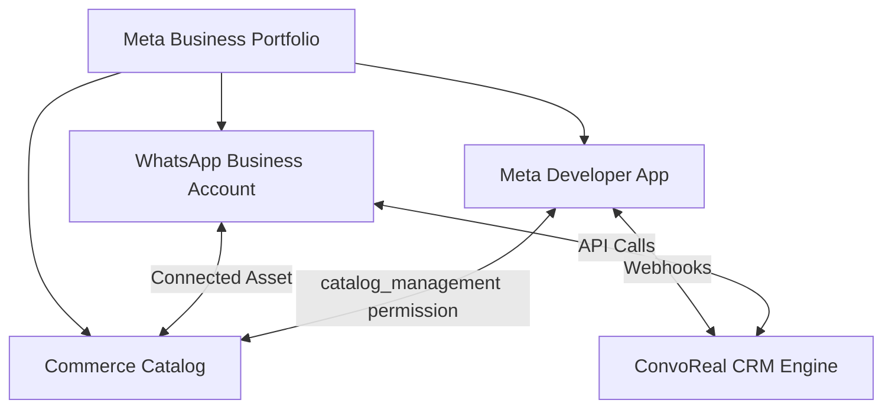

# ConvoReal — Ultimate WhatsApp Onboarding & Configuration Handout
### The Comprehensive Step-by-Step Guide for Setting Up and Connecting New Client WABA Accounts

This document outlines the end-to-end setup process required to integrate a new client's WhatsApp Business API account with **ConvoReal**. Use this as the canonical checklist and reference sheet when onboarding new agencies or configuring developer instances.

---

## High-Level Integration Architecture

---

## Phase 1 — Create a Meta Business Portfolio & Developer Account

Before starting, the client must have a verified Meta Business Portfolio.

### 1.1 Create the Business Manager Portfolio
1. Navigate to the [Meta Business Overview Portal](https://business.facebook.com/overview).
2. Click **Create Account** in the top right.
3. Fill in the forms:
   * **Business Name**: The agency/brand name (e.g., `ConvoReal Agency`).
   * **Your Name**: Administrator's full name.
   * **Business Email**: Corporate email address (requires verification).
4. Verify the link sent to the business email address.

### 1.2 Create the Meta Developer App
1. Go to the [Meta for Developers Portal](https://developers.facebook.com/apps).
2. Click **Create App** (top right button).
3. **Select Use Case**: Choose **Other** $\rightarrow$ **Next** $\rightarrow$ **Business** (or select **"Connect with customers through WhatsApp"**).
4. **App Details**:
   * **App Name**: Enter a recognizable name (e.g. `ConvoReal CRM`).
   * **App Contact Email**: Support or admin email.
   * **Business Portfolio**: Select the newly created Business Manager Portfolio from the dropdown list.
5. Click **Create app**.

---

## Phase 2 — Set Up WhatsApp Business Account & Number

### 2.1 Add WhatsApp Product to App
1. In the App Dashboard sidebar, scroll to the bottom and click **Add Product** (or scroll the main view to WhatsApp and click **Set Up**).
2. Link your Meta Business Portfolio.
3. Click **Continue** to automatically generate a default test account.

### 2.2 Register a Production Phone Number
1. Navigate to the left menu: **WhatsApp** $\rightarrow$ **API Setup**.
2. Scroll down to **Step 5: Add a phone number** and click **Add Phone Number**.
3. Fill in your business profile details:
   * **Display Name**: The name users will see inside WhatsApp (must align with your business brand; see Meta's Display Name Guidelines).
   * **Timezone** & **Category**: Select the relevant timezone and choose **Real Estate** (or similar).
   * **Description**: Optional brief description.
4. **Enter Phone Number**:
   * Input the phone number (mobile or landline).
   * **IMPORTANT**: This number **MUST NOT** be registered on a personal WhatsApp or WhatsApp Business mobile app. If it is, delete the account on the mobile app first.
5. Choose verification method: **SMS** or **Phone Call**, verify the OTP, and click **Save**.

---

## Phase 3 — Generate a Permanent access token (System User)

Standard Developer Console tokens expire in 24 hours. Production instances require a permanent **System User Token**.

### 3.1 Create the System User
1. Go to [Meta Business Settings](https://business.facebook.com/settings).
2. Under **Users** in the left sidebar, click **System Users**.
3. Click **Add** (top of list).
4. Set the **System User Role** to **Admin System User** and name it `ConvoReal_Sync_User`.
5. Click **Create System User**.

### 3.2 Assign Assets to System User
1. Select the new System User and click **Assign Assets**.
2. **Apps**: Select your developer app (e.g., `ConvoReal CRM`) and toggle **Full Control** to **On**.
3. **WhatsApp Accounts**: Select the WhatsApp account associated with the phone number and toggle **Full Control** to **On**.
4. Click **Save Changes**.

### 3.3 Generate the Permanent Token
1. In the System Users view, click **Generate New Token**.
2. Select your app from the dropdown list.
3. Choose **Never** for token expiration.
4. Under **Scopes**, select the following checkmarks:
   * `whatsapp_business_messaging` ✅ (for sending automated replies)
   * `whatsapp_business_management` ✅ (for syncing templates and number details)
   * `catalog_management` ✅ (for syncing properties, required for product cards)
5. Click **Generate**.
6. **Copy and save this token immediately. Meta will never show it again.**

---

## Phase 4 — Commerce Catalog Setup (For Property Cards)

Dynamic property sharing inside WhatsApp requires listing items in a Meta Catalog.

### 4.1 Create the Catalog
1. Navigate to the [Meta Commerce Manager](https://business.facebook.com/commerce).
2. Click **Add Catalog** $\rightarrow$ select **Ecommerce** $\rightarrow$ click **Next**.
3. Under **Configure settings**:
   * Select **Upload product info**.
   * Owner: Select your Business Manager Portfolio.
   * **Catalog Name**: e.g., `ConvoReal Properties`.
4. Click **Create** and go to **Settings** to copy the **Catalog ID** (e.g. `14777590022312`).

### 4.2 Assign Access to System User
1. Go back to [Business Settings](https://business.facebook.com/settings) $\rightarrow$ **Data Sources** $\rightarrow$ **Catalogs**.
2. Select the catalog $\rightarrow$ click **Add People**.
3. Select your **Admin System User** (`ConvoReal_Sync_User`).
4. Toggle **Manage Catalog** to **On** $\rightarrow$ click **Save**.

### 4.3 Link Catalog to WhatsApp Business Account
1. In Business Settings, go to **Accounts** $\rightarrow$ **WhatsApp Accounts**.
2. Select your account and go to the **Settings** tab.
3. Scroll to **Connected Assets** $\rightarrow$ click **Add Assets**.
4. Select the newly created catalog and click **Add**.
   > [!IMPORTANT]
   > If you omit this step, WhatsApp API requests trying to send interactive product templates will be rejected with an API error.

---

## Phase 5 — Webhooks Setup (Inbound Message Ingestion)

Webhooks let the CRM receive real-time updates when customers reply to your bots.

### 5.1 Configure Webhook inside Meta Developer App
1. Open your developer app $\rightarrow$ in the left menu click **WhatsApp** $\rightarrow$ **Configuration**.
2. Locate the **Webhook** section and click **Edit**.
3. Enter the details:
   * **Callback URL**: `https://<your-domain.com>/api/whatsapp/webhook`
   * **Verify Token**: Enter the custom webhook verification secret (configured in `.env.local` as `WEBHOOK_VERIFY_TOKEN`).
4. Click **Verify and save**.
5. Under **Webhook fields**, find **messages** and click **Subscribe**.

---

## Phase 6 — Connecting the WABA in the ConvoReal Dashboard

Once all Meta assets are ready, link them to the client account dashboard:

1. Log in to the **ConvoReal CRM Dashboard** (`https://www.convoreal.com`).
2. Go to **Settings** $\rightarrow$ **WhatsApp Config**.
3. Paste the credentials:
   * **WhatsApp Access Token**: Enter the permanent system user token generated in Phase 3.
   * **Phone Number ID**: Copy from **API Setup** page in Meta console.
   * **WABA ID**: Copy from **API Setup** page in Meta console.
   * **Meta Catalog ID**: Enter the catalog ID created in Phase 4.
   * **Auto-Sync Catalog**: Check this box to automatically update the Meta Catalog whenever a property is added or edited in the inventory.
4. Click **Save Configuration**.

---

## Phase 7 — App Review & Going Live

To take the app out of Developer Mode and use it with public end-user catalogs:

1. In the App Basic settings, update:
   * **Privacy Policy URL**: `https://www.convoreal.com/privacy`
   * **Terms of Service URL**: `https://www.convoreal.com/terms`
   * **User Data Deletion Callback URL**: `https://www.convoreal.com/privacy#data-deletion`
2. Go to **Review** $\rightarrow$ **Permissions and Features**.
3. Submit a request for the `catalog_management` feature.
4. Provide a screen recording (under 2 minutes) showing properties syncing from the ConvoReal inventory dashboard to the Meta Catalog and being shared on WhatsApp.

---

## User Flow Checklist & Screenshots Placeholder

*(Note: When deployment is verified, insert screenshots under each header below to assist client support teams)*

### [PLACEHOLDER] How to Retrieve Phone Number ID and WABA ID
*Insert screenshot of Meta Developer App -> WhatsApp -> API Setup dashboard highlighting the values.*

### [PLACEHOLDER] How to Generate System User Token
*Insert screenshot of Meta Business Settings -> System Users view pointing at "Generate New Token" button.*

### [PLACEHOLDER] Property Sync and Sharing Flow
*Insert screenshot of the "Sync to Meta Catalog" button inside the property form details and WhatsApp Product Card in message logs.*
